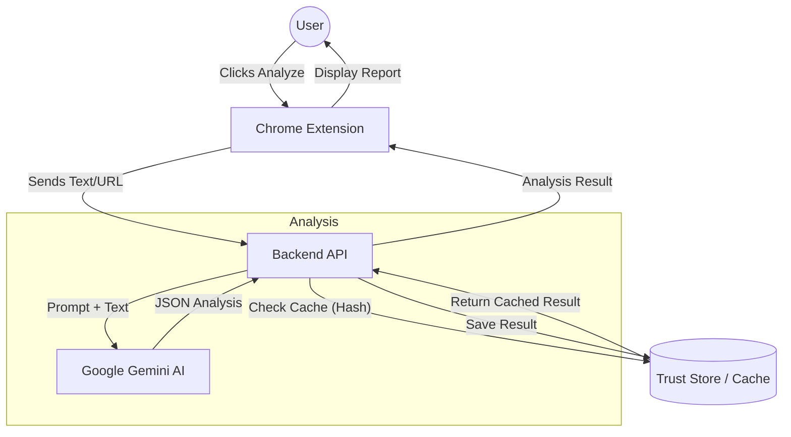

# Terms & Conditions Analyzer

A Chrome Extension that analyzes Terms & Conditions (or any legal text) on a webpage using Google's Gemini AI to identify risks and summarize key points.

## Project Structure

*   **`extension/`**: Chrome Extension (Manifest V3, React, TypeScript, Vite, Tailwind CSS).
*   **`backend/`**: Node.js Backend (Fastify, TypeScript, Gemini SDK, Zod).

### System Architecture



## Prerequisites

*   Node.js (v18 or higher)
*   Google Gemini API Key (Get one at [aistudio.google.com](https://aistudio.google.com/))

## Setup & Running

### 1. Backend Setup

The backend handles the communication with the Gemini API to keep your API key secure.

1.  Navigate to the backend directory:
    ```bash
    cd backend
    ```
2.  Install dependencies:
    ```bash
    npm install
    ```
3.  Configure your environment variables:
    *   Open `.env` file (created automatically)
    *   Add your Gemini API Key: `GEMINI_API_KEY=your_actual_api_key_here`
4.  Start the server:
    ```bash
    npm run dev
    ```
    The server will run on `http://localhost:3000`.

### 2. Extension Setup

1.  Navigate to the extension directory:
    ```bash
    cd extension
    ```
2.  Install dependencies:
    ```bash
    npm install
    ```
3.  Build the extension:
    ```bash
    npm run build
    ```
    This creates a `dist` folder.

### 3. Loading into Chrome

1.  Open Google Chrome and go to `chrome://extensions/`.
2.  Enable **Developer mode** (toggle in the top right).
3.  Click **Load unpacked**.
4.  Select the `extension/dist` folder you just built.

## Usage

1.  Ensure the backend server is running (`npm run dev` in `backend/`).
2.  Navigate to any webpage containing Terms & Conditions (e.g., a signup page or footer link).
3.  Click the **Otter** icon in your Chrome toolbar.
4.  Click **Analyze Terms**.
5.  Watch the mascot react as it reads, thinks, and presents the risk assessment!

## Tech Stack

*   **Frontend**: React, Tailwind CSS, Vite
*   **Backend**: Node.js, Fastify, Zod
*   **AI**: Google Gemini (via `@google/genai` SDK)
*   **Language**: TypeScript throughout
